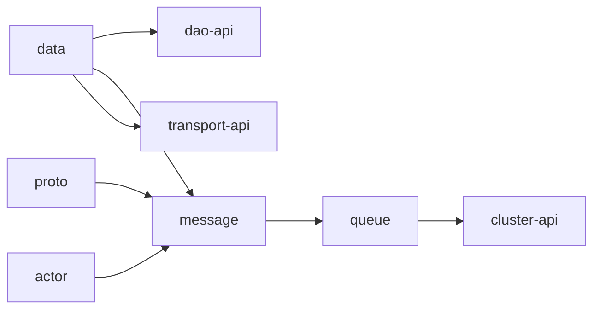

# ThingsBoard `common` Module

Maven artifact: `org.thingsboard:common` (aggregator POM)  
**~1,900 Java files** across shared libraries used by `application`, `dao`, `transport`, and microservices.

`common` does **not** expose HTTP REST endpoints. It provides:

- **Domain models** (`data`)
- **DAO contracts** (`dao-api`) — implemented in `dao`
- **Protobuf / queue messages** (`proto`, `message`)
- **Kafka abstractions** (`queue`, `cluster-api`)
- **Device protocol helpers** (`transport/*`)
- **Actor system** (`actor`)
- **Cache** (`cache`)
- **Script execution API** (`script`)
- **EDQS query types** (`edqs`)

## Submodule map

| Submodule | Artifact | Purpose |
|-----------|----------|---------|
| [data](data/) | `common/data` | Entities, IDs, queries, profiles, notifications, CF, alarms |
| [dao-api](dao-api/) | `common/dao-api` | Service interfaces (persistence API) |
| [proto](proto/) | `common/proto` | `.proto` → Java (`gen.transport`, etc.) |
| [message](message/) | `common/message` | `TbMsg`, actor messages, queue wrappers |
| [queue](queue/) | `common/queue` | Kafka consumers/producers, discovery, EDQS queues |
| [cluster-api](cluster-api/) | `common/cluster-api` | `TbClusterService`, `TbQueueMsg`, cluster broadcast |
| [actor](actor/) | `common/actor` | `TbActorSystem` — lightweight actor runtime |
| [transport](transport/) | `common/transport` | Shared MQTT/HTTP/CoAP/LwM2M/SNMP + `transport-api` |
| [cache](cache/) | `common/cache` | Valkey/Redis/Caffeine caches |
| [coap-server](coap-server/) | `common/coap-server` | CoAP server building blocks |
| [edge-api](edge-api/) | `common/edge-api` | Edge RPC client API |
| [version-control](version-control/) | `common/version-control` | Git VC service API types |
| [script](script/) | `common/script` | JS/TBEL invoke (`script-api`, `remote-js-client`) |
| [edqs](edqs/) | `common/edqs` | Entity Data Query Service — query processors |
| [util](util/) | `common/util` | Shared utilities (JSON, geo, executors) |
| [stats](stats/) | `common/stats` | Metrics helpers |
| [discovery-api](discovery-api/) | `common/discovery-api` | Service discovery metadata |

Detailed indexes:

- [DAO_API_SERVICES.md](./DAO_API_SERVICES.md) — all `*Service` interfaces in `dao-api`
- [PROTO_AND_MESSAGING.md](./PROTO_AND_MESSAGING.md) — protobuf, `TbMsg`, queues
- [DEVICE_PROTOCOLS.md](./DEVICE_PROTOCOLS.md) — transport API (not REST)
- [MODULES.md](./MODULES.md) — per-submodule package layout

REST HTTP APIs live in **`application`** — see [../application/README.md](../application/README.md) and [../docs/REST_API.md](../docs/REST_API.md).

## Dependency flow

## Where to look in code

| Need | Start here |
|------|------------|
| Device / Tenant / Alarm model | `data/.../Device.java`, `Tenant.java`, `Alarm.java` |
| Typed IDs | `data/.../id/EntityId.java`, `DeviceId.java` |
| Entity type enum | `data/.../EntityType.java` |
| Rule engine message | `message/.../TbMsg.java` |
| Save device to DB | `dao-api/.../DeviceService.java` → impl in `dao` |
| Transport → core | `transport/transport-api/.../TransportService.java` |
| Cross-node events | `cluster-api/.../TbClusterService.java` |
| Run JS in rule node | `script/script-api/.../ScriptInvokeService.java` |

## Commenting convention in this repo

Because of module size, documentation is layered:

1. **Markdown** in `common/*.md` (this folder)
2. **`package-info.java`** on major Java packages
3. **Class-level Javadoc** on core types (`EntityId`, `TbMsg`, `TransportService`, …)
4. **Method Javadoc** on public service interfaces where behavior is non-obvious

To regenerate the full REST catalog: `python tools/scripts/generate_rest_api_doc.py` → `docs/REST_API.md`.
